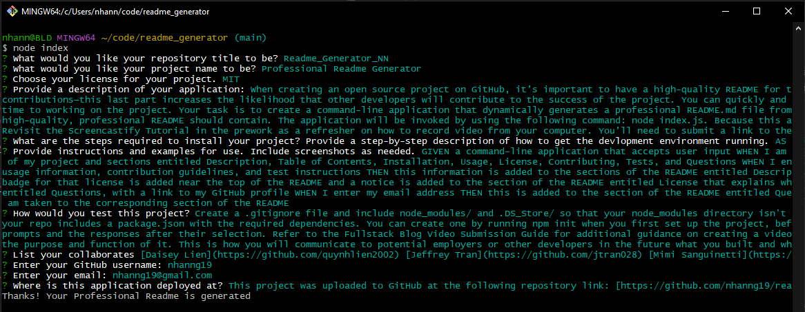

# 09_Node.js_NN
Node.js: Professional README Generator

## The Challenge
When creating an open source project on GitHub, it’s important to have a high-quality README for the app. This should include what the app is for, how to use the app, how to install it, how to report issues, and how to make contributions&mdash;this last part increases the likelihood that other developers will contribute to the success of the project. 

We can quickly and easily create a README file by using a command-line application to generate one. This allows the project creator to devote more time to working on the project.

Our task is to create a command-line application that dynamically generates a professional README.md file from a user's input using the [Inquirer package](https://www.npmjs.com/package/inquirer/v/8.2.4).

The application will be invoked by using the following command:

```bash
node index.js
```

Because this application won’t be deployed, we'll also need to provide a link to a walkthrough video that demonstrates its functionality. We’ll need to submit a link to the video _and_ add it to the README.



[LINK TO THE VIDEO](https://drive.google.com/file/d/17mvdLqx0fT00417CcV9HXt1qx9cjSI6Z/view)


## User Story

```
AS A developer.
I WANT a README generator
SO THAT I can quickly create a professional README for a new project
```

## Acceptance Criteria

```
GIVEN a command-line application that accepts user input
WHEN I am prompted for information about my application repository
THEN a high-quality, professional README.md is generated with the title of my project and sections entitled Description, Table of Contents, Installation, Usage, License, Contributing, Tests, and Questions
WHEN I enter my project title
THEN this is displayed as the title of the README
WHEN I enter a description, installation instructions, usage information, contribution guidelines, and test instructions
THEN this information is added to the sections of the README entitled Description, Installation, Usage, Contributing, and Tests
WHEN I choose a license for my application from a list of options
THEN a badge for that license is added near the top of the README and a notice is added to the section of the README entitled License that explains which license the application is covered under
WHEN I enter my GitHub username
THEN this is added to the section of the README entitled Questions, with a link to my GitHub profile
WHEN I enter my email address
THEN this is added to the section of the README entitled Questions, with instructions on how to reach me with additional questions
WHEN I click on the links in the Table of Contents
THEN I am taken to the corresponding section of the README
``` 

## The Process
To satisfy the criteria, we had to:
- Install inquirer package
- Install fs module
- Create index javascript file prompting input for users
- Create generateMarkdown javascript file writing data to generated readme file

Specific functions of index.js

```
- Initialize variables importing necessary files and packages
- List prompt and store answers as specific data type in memory
- Generate READme based on user's input
```

Specific functions of generateMarkdown.js

```
- Render license badge if user choose license option
- Render license section if user choose license option
- Function rendering data for READme file based on user's input
```

## The Result
After dynamically coding Index.js and generateMarkdownjs , we were able to provide an engaging, efficient, and stuctured Node.js application that generates a professional README file.

## Submission
This project was uploaded to GitHub at the following repository link:
[https://github.com/nhanng19/readme_generator](https://github.com/nhanng19/readme_generator)

Walkthrough video: [https://drive.google.com/file/d/17mvdLqx0fT00417CcV9HXt1qx9cjSI6Z/view](https://drive.google.com/file/d/17mvdLqx0fT00417CcV9HXt1qx9cjSI6Z/view)
